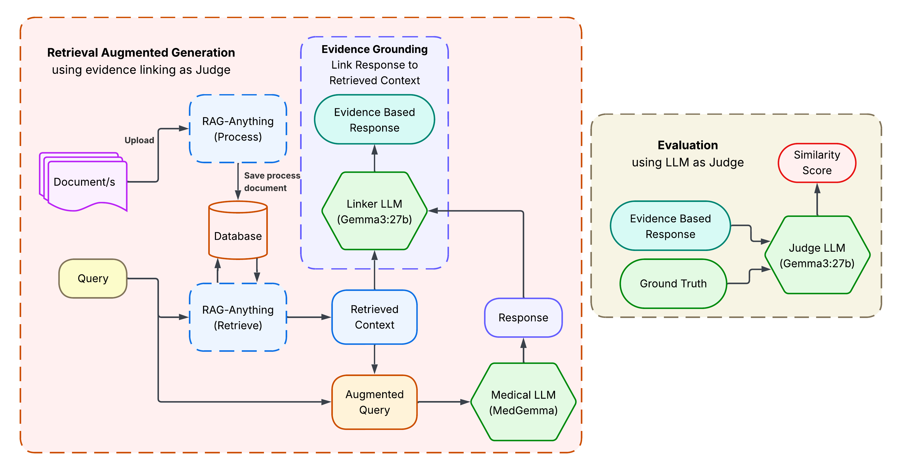

# VERT: Verifiable Evidence Retrieval Tool for Healthcare Systematic Reviews
This repository contains the source code accompanying the research paper titled **"VERT: Verifiable Evidence Retrieval Tool for Healthcare Systematic Reviews"** submitted to ***SECURE-AI4H:1st Workshop on Safe, Ethical, Certified, Uncertainty-aware, Robust, and Explainable AI for Health***. The code is provided to support reproducibility and further research. This code is part of a double-blind peer review submission. All identifying details have been anonymized to comply with the guidelines.
## Description 
A multimodal Retrieval-Augmented Generation (RAG) system that delivers trustworthy, evidence-grounded answers from user-uploaded medical documents, complete with precise, traceable references.

## Architecture


## Installation
Clone the repository and install the required dependencies:
```bash
git clone <repo_url>
cd med-chat
pip install -r requirements.txt
```
# Replicating Results
This section outlines the exact steps required to reproduce the experimental results from this project.
```bash
project/
│
├── config.json           # Model + pipeline configuration
├── config.py             # Loads and parses config.json
│
├── data/                 # Folder containing all source documents
├── QA.json               # Evaluation questions for RAG inference
│
├── main.py               # Main script for RAG-based response generation
├── test.py               # LLM-as-Judge scoring script
│
└── outputs/              # Generated responses & evaluation scores (created after run)
```

## Model Configuration
All hyperparameters, model names, embedding settings, and RAG parameters are defined in `config.json`
The configuration file is automatically loaded by: `config.py`

## Documents for Retrieval
All documents used for retrieval-augmented generation must be placed inside `data/`
Ensure that documents are in `.pdf` format

## Questions
All evaluation questions are be stored in `QA.json`

## Run Response Generation
```bash
python main.py
```
## Evaluation
```bash
python test.py
```